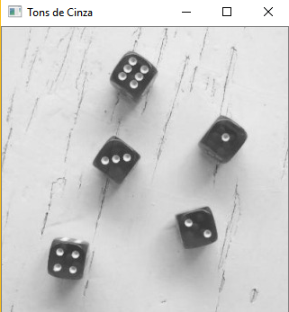
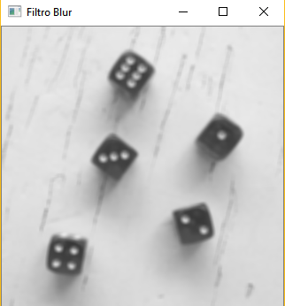
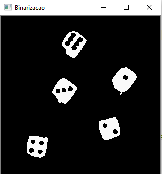
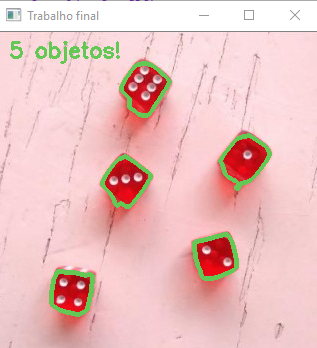

## 1ª Questão

Imagem Original

Converta a imagem para tons de cinza .

Aplique o filtro blur para retirar os ruídos e facilitar a identificação das bordas dos
objetos.

Aplique binarização na imagem resultando em pixels pretos e brancos.

Aplique a técnica de detecção de bordas para identificar os objetos.
Com as bordas identificadas, conte os contornos externos para achar a
quantidade de dados presentes na imagem.

Resultado

## 2 Questão

Local: Plantio de Soja

Problema: As pragas e doenças na soja são obstáculos que sempre ameaçam as lavouras desse grão. As pragas são mais perceptível ao ser humano,
já as doenças precisam serem analizadas em laboratórios podendo demorar dias o que pode perder parte da lavoura.

Descrição: A aplicação seria responsável de detectar as doenças na folha da planta, as doenças que são possíveis detectar
através da coloração e textura. O agricultor tiraria fotos de partes da lavoura em locais distintos,
cada foto teria uns metadados para armazenar o local do plantio
e o aplicativo classificava essas imagens é infectadas e não infectadas, as que fossem infectada ele iria classificar qual a doença
agilizando o tempo para remediar a doença.
